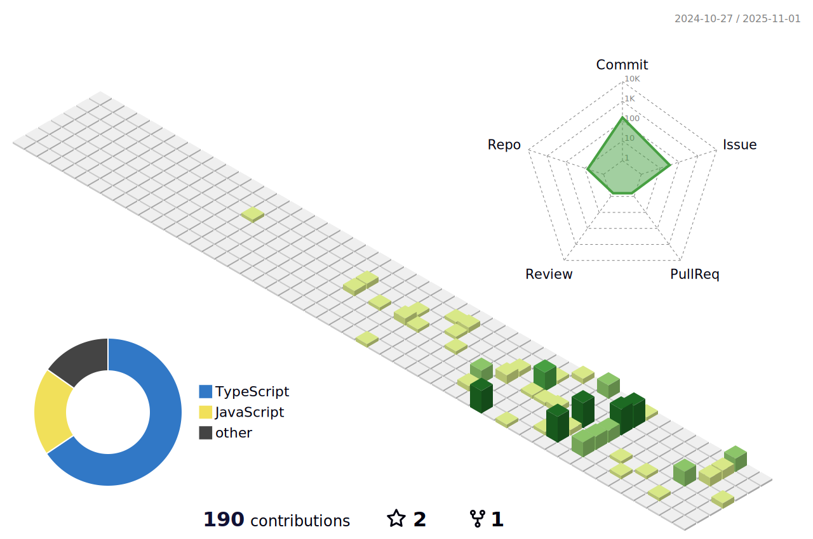

# 你好，这里是WRD1145的主页👋
~~一个废物😋~~

## 总览

## 联系方式
请发送邮件至HiWRD1@163.com并注明来意，邮件不经常看，建议加QQ1640884306

## 我正在学习/会的语言和架构😋
C#~~(但是非常烂)~~  Python C++ PHP JavaScript CSS HTML

## 我的另外Github账号
[@HelloWRD1145](https://github.com/HelloWRD1145)
[@WRD1145S](https://github.com/WRD1145S)
